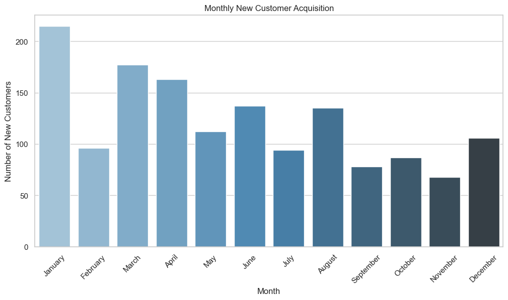
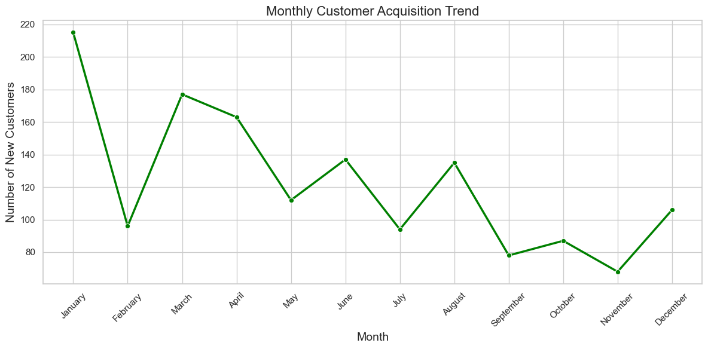
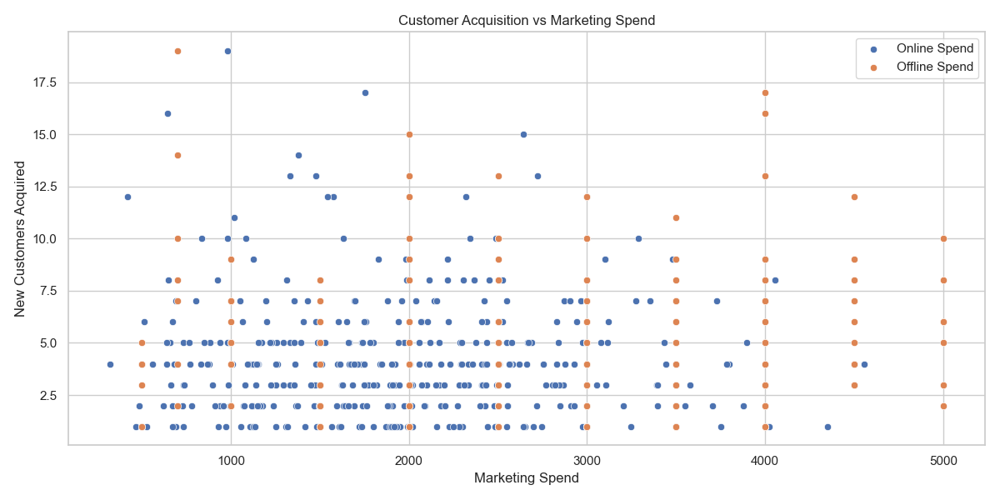
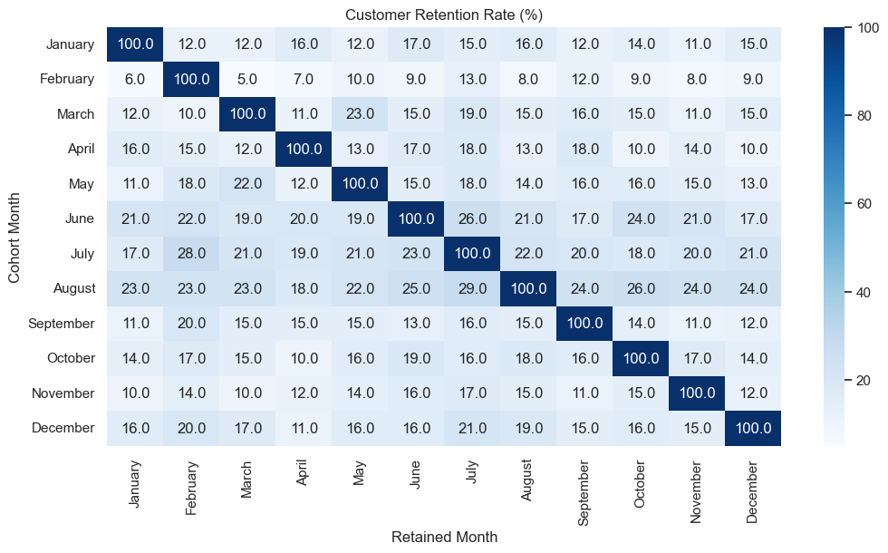
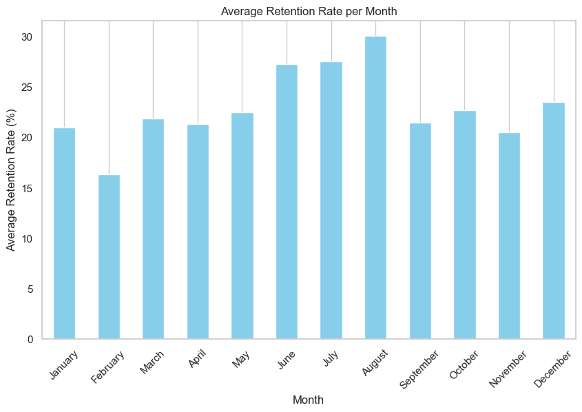
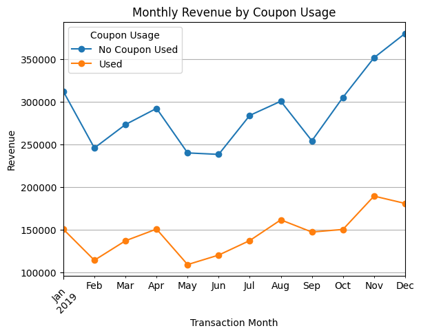
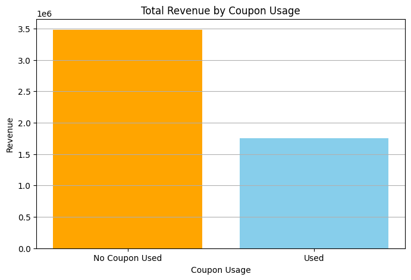

📊 E-commerce Marketing & Sales Case Study

💡 **Business Objective**

This project aims to analyze key customer and sales trends for an e-commerce company to improve customer acquisition, retention, and overall revenue generation. Through data exploration and visualization, we uncover actionable insights to support strategic decisions.

📂 **Dataset Overview**

**Source**: [Data Folder](./data/)

**Contents**: Online_Sales.csv, CustomersData.xlsx, Discount_Coupon.csv, Marketing_Spend.csv, Tax_amount.xlsx

📅 Analysis Scope

This analysis addresses 20 key business questions:

**Business Question 1:** Identify the months with the highest and lowest acquisition rates. What strategies could be implemented to address the fluctuations and ensure consistent growth throughout the year?

**Answer:** 
    Please find chart here : [acquisition_trend barplot](./images/Q1_acquisition_barplot.png) , [acquisition_trend lineplot](./images/Q2_acquisition_lineplot.png)

    **Highest Acquisition**

        January 2019 (~215 customers), followed by March and April.

    **Lowest Acquisition:**

        November 2019 (~70 customers), followed by September and October.

    **Trend:**
        There is a steady decline in customer acquisition throughout the year.

    
    strategies : 
        1) As January has the highest monthly acquisitions, align promotional campaigns with peak months and improve visibility in weaker months. This matches the count near the peak month. 

        2) To increase month-on-month growth, introduce new offers and spend more on marketing. Encourage referrals with great offers and perks for both existing and new users. 

**Business Question 2:** Analyze the data to determine if certain months consistently show higher or lower acquisition rates. How can the company capitalize on high-performing months and improve performance during slower periods?

**Answer:** 
    Please find chart here :  [acquisition_trend barplot](./images/Q1_acquisition_barplot.png) , [acquisition_trend lineplot](./images/Q2_acquisition_lineplot.png) , [Scatter Plot](./images/acquisition_vs_marketing_scatter.png)

    **Analysis:**

        **Top 25% Months by Acquisition (High-performing):**

            January (215), March (177), April (163)

        **Bottom 25% Months (Low-performing):**

            September (78), October (87), November (68)

    **Trend:**

        1) We saw strong customer growth from January to April, likely due to successful early-year campaigns or the 2) usual new-year shopping enthusiasm.

        2) From June onward, customer numbers started dropping steadily, hitting the lowest point in November.

        3) There wasn’t much of a bounce-back in December, which means end-of-year efforts didn’t have a big impact.

    
    **strategies :**(How can the company capitalize on high-performing months and improve performance during slower periods?)

        1) Focus on the Best Months: Put more marketing money and effort into January to April, when customer sign-ups are strong. Look at what worked in the past and do more of that.

        2) Find Out What’s Going Wrong in Slow Months: Dig into the data from slower months like September to November. Check where your traffic is coming from, how far users get, and why they might be dropping off.

        3) Try Offers During Slow Periods: Run special deals or referral bonuses during the quiet months to see if they help bring in more customers.

        4) Plan Ahead with Predictions: Use simple forecasting tools to spot future slowdowns early. That way, you can plan smart marketing moves before things dip.

    📈 Customer Acquisition vs. Marketing Spend: 

            To understand what influences customer acquisition, marketing data was chosen for analysis. Other datasets like sales, coupons, and tax were excluded because they are either related to customer behavior after acquisition (like sales and coupon usage) or are not directly relevant (like tax rates).

            Marketing efforts, especially online and offline campaigns, are directly responsible for creating awareness and attracting potential new customers. This made the marketing dataset the most relevant for analyzing acquisition trends.

            Daily marketing spend data was combined with daily customer acquisition counts, which were calculated from each customer’s first transaction date. A scatter plot was used to visualize the relation between marketing spend and new customer acquisition. Correlation was then calculated to measure the strength of the relationship.

    🔍 Correlation Matrix:

            Online_Spend	Offline_Spend	New_Customers
            Online_Spend	1.000	0.360	-0.033
            Offline_Spend	0.360	1.000	-0.024
            New_Customers	-0.033	-0.024	1.000

    The results showed a very weak negative correlation between both online and offline marketing spend and new customer acquisition. This indicates that higher spending on any particular day did not strongly influence how many customers joined on that same day.

**Business Question 3:** Identify periods with the strongest and weakest retention rates. What strategies could be implemented to improve retention during weaker months?

**Answer:** 
    Please find chart here : [Retention Rate HeatMap](./images/Q3_RetentionRate.png) , [Avg Retention Rate Barplot](./images/Q3_AvgRetentionRate.png)

    **Approach:**

        1) Built a retention matrix using transaction data.

        2) Used a heatmap to quickly spot how customers came back over months.

        3) Created a simple average retention trend per month.

    **Key Findings:**

        **Heatmap Observation:**
            1) Customers acquired in August and July showed better retention trends, with higher percentages in the following months.

            2) February and April had the lowest retention, showing rapid drop after the first month.

        **Retention Trend Chart Insight:**
            1) The average retention rate peaked in August (~30%), while February was the lowest (~16%).

            2) This pattern suggests mid-year cohorts tend to be more loyal.

    
    strategies : 
        1) For Feb and April, let's look deeper into what campaigns or offers we used and how those customers behaved.

        2) Try early follow-ups, personalized nudges, or small loyalty perks—especially in their first week.

        3) For Jul and Aug, let's learn what worked well and try replicating those strategies during weak months.

**Business Question 4:** **Analyze customer behavior during high retention months and suggest ways to replicate this success throughout the year.**

**Answer:** 
    Quick Access to Graphs:
- [Marketing Spend vs Retention Rate](images/Q4Marketing%20Spend%20vs%20Retention%20Rate.png)
- [Online Spend vs Retention Rate](images/Q4Online%20Spend%20vs%20Retention%20Rate.png)
- [Coupon Usage % vs Retention Rate](images/Q4Coupon%20Usage%20%25%20vs%20Retention%20Rate.png)
- [Avg Order Value & Delivery Charges vs Retention Rate](images/Q4Avg%20Order%20Value%20%26%20Delivery%20Charges%20vs%20Retention%20Rate.png)
- [Correlation Heatmap - Monthly Data](images/Q4Correlation%20Heatmap%20-%20Monthly%20Data.png)

    **Approach:**

    1. Built a **retention matrix** to track how customers came back over months.
    2. Created a **consolidated monthly dataset** with key data (marketing, coupons, order value, delivery charges, retention).
    3. Used **simple plots and heatmaps** to find trends and patterns.
    4. Checked **correlation matrix** to spot what really impacts retention.
    5. Based on data, gave **clear recommendations** to improve retention in low months.

    **Key Findings:**

    | Parameter              | Observation                                         | Conclusion                                       |
    |------------------------|-----------------------------------------------------|-----------------------------------------------------|
    | Marketing Spend        | High spend months had low retention                 | Spending more didn't help retention                 |
    | Coupon Usage %         | Same across months; no big effect on retention      | Coupons are not helping retention                   |
    | Avg Order Value        | Low in high retention months                        | Small, frequent orders help keep customers coming   |
    | Avg Delivery Charges   | Lowest in high retention months                     | Lower delivery costs = better retention             |
    | Correlation Heatmap    | Strong negative link with order value & delivery charges | Lower ticket size and delivery charges matter most  |

    📈 Visual Summary

        ✅ Marketing Spend vs Retention Rate:
          - No clear trend.
          - High marketing spend does not guarantee higher retention.

  

        ✅ Online Spend vs Retention Rate (Scatter):
        - Random scatter.
        - Weak correlation (-0.10).

        

        ✅ Coupon Usage % vs Retention Rate (Scatter):
        - No clear trend.
        - Coupons show flat impact on retention.

        

        ✅ Avg Order Value & Delivery Charges vs Retention Rate:
        - Clear negative correlation.
        - Low ticket size + Low delivery charges = High retention months.

        ✅ Correlation Heatmap:
         - Confirmed all the above statistically.

         

    **Recommendations :**

        | Strategy                                                     | Reason                                                    |
        |--------------------------------------------------------------|--------------------------------------------------------|
        | Cut delivery charges in low retention months                 | Low delivery charges improve retention                 |
        | Promote small, bundle offers                                 | Customers like low ticket, frequent buys               |
        | Stop spending more on ads without a clear strategy           | High spend months still had low retention              |
        | Use smarter, product-specific coupons                        | Current generic coupons are not working                |
        | Push winning products (like Drinkware, Apparel) in low months| These worked well in high retention months             |

    **Conclusion :**
        Retention is more about customer experience (low order value, delivery charges), not just ads or coupons.
        Focus on easy, low-friction buying and right product targeting in low months.

**Business Question 5:** **Compare the revenue generated by new and existing customers month-over-month. What does this trend suggest about the balance between acquisition and retention efforts?**

**Answer:** 
    Quick Access to Graphs:
- [Monthly Revenue from New vs Existing Customers](images/Q5MonthlyRevenuevsExistingCustomer.png)

    **Approach:**

        1) Labeled customers as New or Existing based on their first purchase month.
        2) New Customers: Customers whose first purchase occurred in the same month.
        3) Existing Customers: Customers who made purchases after their first transaction month.
        4) Calculated monthly revenue contribution from both customer segments.
        5) Used a stacked bar chart to visualize the month-over-month revenue comparison.

    **Key Findings:**

    | Period                  | Insights                                                                                      |
    | ----------------------- | --------------------------------------------------------------------------------------------- |
    | **January to May**      | Revenue was mainly driven by new customers. Existing customer contribution was low.           |
    | **June to December**    | Existing customers started contributing more significantly, especially from October onwards.  |
    | **November & December** | Highest existing customer revenue observed, indicating strong retention and repeat purchases. |

    📈 Interpretation:

    1) The business initially relied heavily on acquisition to drive revenue.

    2) Over time, retention strategies improved, leading to stronger existing customer engagement.

    3) The increasing contribution of existing customers is a healthy indicator of improving customer loyalty and satisfaction.

    🎯 Recommendations :

    1) Keep working on retaining existing customers by offering things like loyalty programs, personalized discounts, and follow-up messages.

    2) Don't stop bringing in new customers, but also try to get more value from the existing customers by encouraging them to buy again.

    3) Look at what worked well in November and December, and try to do the same in other months to keep the revenue high.

**Business Question 6:** **Analyze the relationship between coupon usage and revenue generation. How can discount strategies be optimized to maximize revenue while maintaining profitability?**

**Answer:** 
    Quick Access to Graphs:
- [MonthlyRevenuebyCouponUsage](images/Q6MonthlyRevenuebyCouponUsage.png)
- [TotalRevenuebyCouponUsage](images/Q6TotalRevenuebyCouponUsage.png)

    **Approach:**

        We looked at orders where coupons were used vs not used (including those who clicked but didn’t apply).

        We checked how much revenue came from each group, and how that changed month by month.

        We also cleaned the data to group “Clicked” and “Not Used” together as “No Coupon Used”.

    **Key Findings:**

        Most of the revenue came from people who didn’t use coupons.
        1) In fact, they brought in almost twice as much revenue as those who used coupons.

        2) Month by month, this pattern stayed the same — people paying full price (no coupon) always gave more revenue.

        3) Even in big months like November and December, coupon users never outperformed non-coupon users.

        4) Coupon usage did grow slowly over the year, but still didn’t beat full-price orders.

    📈 Interpretation:

        1) The company is doing well because most customers are buying without needing discounts.

        2) Coupons aren’t bringing huge extra revenue — they’re helping a bit, but not a game-changer.

    🎯 Recommendations :

       1) Don’t give discounts to everyone. Since people are paying full price anyway, save coupons for special cases.

       2) Use coupons only:

            In slow months

            For products that aren’t selling well

            For limited-time offers (to create urgency)

       3) Keep an eye on coupon users — if they only buy when discounts are given, they may not be loyal customers.

📊 Key Visualizations

Plots are saved under /images and referenced in the notebook.

🔧 Tools Used

Python (Pandas, NumPy, Matplotlib, Seaborn)

Jupyter Notebook

📁 Repository Structure

ecommerce-case-study/
├── data/                      # Raw data files
├── images/                    # Visualizations
├── ecommerce_analysis.ipynb   # Complete code and analysis
├── README.md                  # Project summary and insights
└── requirements.txt           # Python dependencies

🚀 How to Run

Clone the repository

Install dependencies: pip install -r requirements.txt

Open ecommerce_analysis.ipynb to explore the full analysis

📅 Prepared by: Harsha

