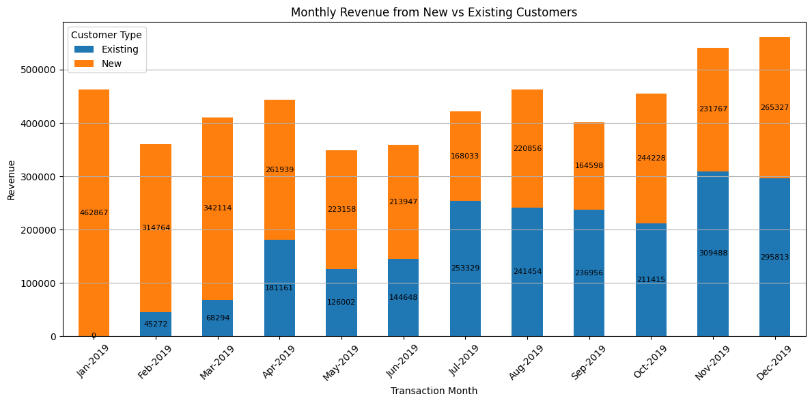
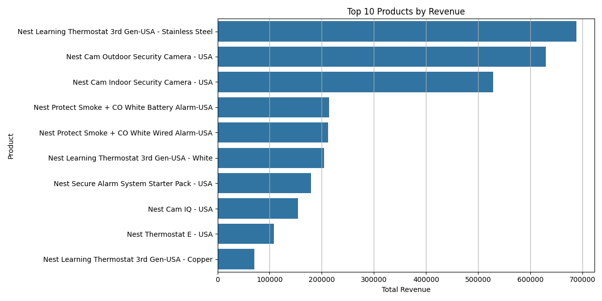
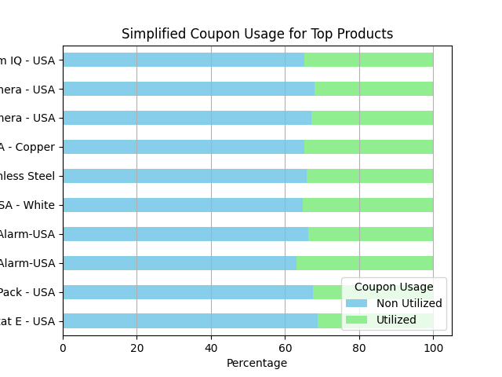
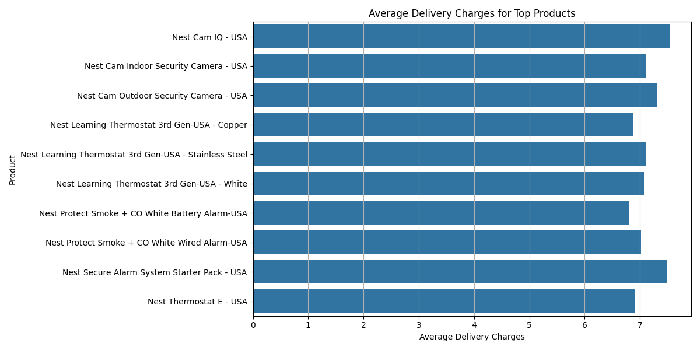
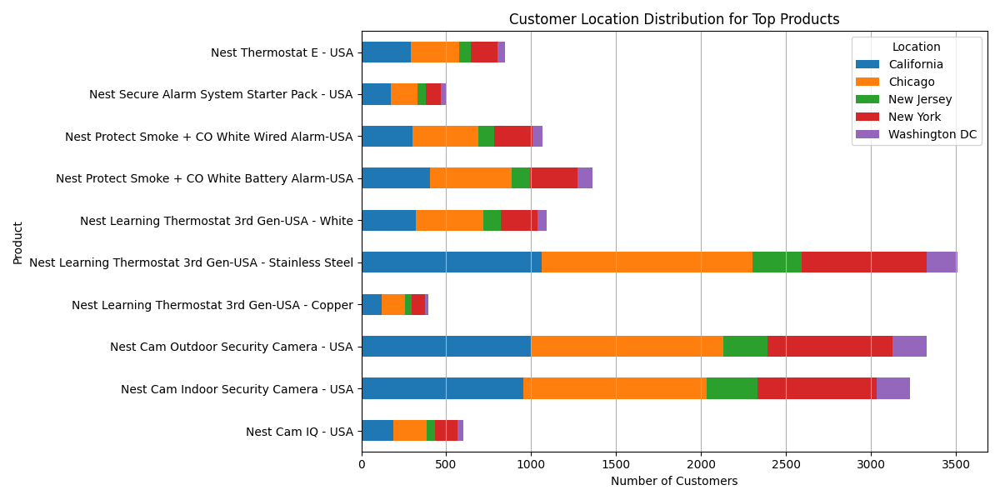
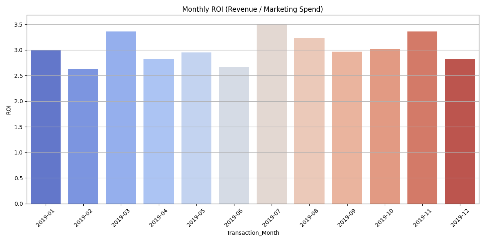
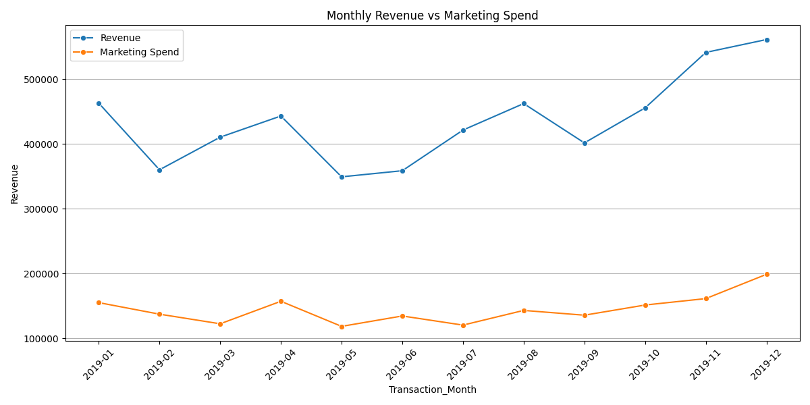

📊 E-commerce Marketing & Sales Case Study

💡 **Business Objective**

This project aims to analyze key customer and sales trends for an e-commerce company to improve customer acquisition, retention, and overall revenue generation. Through data exploration and visualization, we uncover actionable insights to support strategic decisions.

📂 **Dataset Overview**

**Source**: [Data Folder](./data/)

**Contents**: Online_Sales.csv, CustomersData.xlsx, Discount_Coupon.csv, Marketing_Spend.csv, Tax_amount.xlsx

📅 Analysis Scope

This analysis addresses 20 key business questions:

**Business Question 1:** Identify the months with the highest and lowest acquisition rates. What strategies could be implemented to address the fluctuations and ensure consistent growth throughout the year?

**Answer:** 
    Please find chart here : [acquisition_trend barplot](./images/Q1_acquisition_barplot.png) , [acquisition_trend lineplot](./images/Q2_acquisition_lineplot.png)

    **Highest Acquisition**

        January 2019 (~215 customers), followed by March and April.

    **Lowest Acquisition:**

        November 2019 (~70 customers), followed by September and October.

    **Trend:**
        There is a steady decline in customer acquisition throughout the year.

    
    strategies : 
        1) As January has the highest monthly acquisitions, align promotional campaigns with peak months and improve visibility in weaker months. This matches the count near the peak month. 

        2) To increase month-on-month growth, introduce new offers and spend more on marketing. Encourage referrals with great offers and perks for both existing and new users. 

**Business Question 2:** Analyze the data to determine if certain months consistently show higher or lower acquisition rates. How can the company capitalize on high-performing months and improve performance during slower periods?

**Answer:** 
    Please find chart here :  [acquisition_trend barplot](./images/Q1_acquisition_barplot.png) , [acquisition_trend lineplot](./images/Q2_acquisition_lineplot.png) , [Scatter Plot](./images/acquisition_vs_marketing_scatter.png)

    **Analysis:**

        **Top 25% Months by Acquisition (High-performing):**

            January (215), March (177), April (163)

        **Bottom 25% Months (Low-performing):**

            September (78), October (87), November (68)

    **Trend:**

        1) We saw strong customer growth from January to April, likely due to successful early-year campaigns or the 2) usual new-year shopping enthusiasm.

        2) From June onward, customer numbers started dropping steadily, hitting the lowest point in November.

        3) There wasn’t much of a bounce-back in December, which means end-of-year efforts didn’t have a big impact.

    
    **strategies :**(How can the company capitalize on high-performing months and improve performance during slower periods?)

        1) Focus on the Best Months: Put more marketing money and effort into January to April, when customer sign-ups are strong. Look at what worked in the past and do more of that.

        2) Find Out What’s Going Wrong in Slow Months: Dig into the data from slower months like September to November. Check where your traffic is coming from, how far users get, and why they might be dropping off.

        3) Try Offers During Slow Periods: Run special deals or referral bonuses during the quiet months to see if they help bring in more customers.

        4) Plan Ahead with Predictions: Use simple forecasting tools to spot future slowdowns early. That way, you can plan smart marketing moves before things dip.

    📈 Customer Acquisition vs. Marketing Spend: 

            To understand what influences customer acquisition, marketing data was chosen for analysis. Other datasets like sales, coupons, and tax were excluded because they are either related to customer behavior after acquisition (like sales and coupon usage) or are not directly relevant (like tax rates).

            Marketing efforts, especially online and offline campaigns, are directly responsible for creating awareness and attracting potential new customers. This made the marketing dataset the most relevant for analyzing acquisition trends.

            Daily marketing spend data was combined with daily customer acquisition counts, which were calculated from each customer’s first transaction date. A scatter plot was used to visualize the relation between marketing spend and new customer acquisition. Correlation was then calculated to measure the strength of the relationship.

    🔍 Correlation Matrix:

            Online_Spend	Offline_Spend	New_Customers
            Online_Spend	1.000	0.360	-0.033
            Offline_Spend	0.360	1.000	-0.024
            New_Customers	-0.033	-0.024	1.000

    The results showed a very weak negative correlation between both online and offline marketing spend and new customer acquisition. This indicates that higher spending on any particular day did not strongly influence how many customers joined on that same day.

**Business Question 3:** Identify periods with the strongest and weakest retention rates. What strategies could be implemented to improve retention during weaker months?

**Answer:** 
    Please find chart here : [Retention Rate HeatMap](./images/Q3_RetentionRate.png) , [Avg Retention Rate Barplot](./images/Q3_AvgRetentionRate.png)

    **Approach:**

        1) Built a retention matrix using transaction data.

        2) Used a heatmap to quickly spot how customers came back over months.

        3) Created a simple average retention trend per month.

    **Key Findings:**

        **Heatmap Observation:**
            1) Customers acquired in August and July showed better retention trends, with higher percentages in the following months.

            2) February and April had the lowest retention, showing rapid drop after the first month.

        **Retention Trend Chart Insight:**
            1) The average retention rate peaked in August (~30%), while February was the lowest (~16%).

            2) This pattern suggests mid-year cohorts tend to be more loyal.

    
    strategies : 
        1) For Feb and April, let's look deeper into what campaigns or offers we used and how those customers behaved.

        2) Try early follow-ups, personalized nudges, or small loyalty perks—especially in their first week.

        3) For Jul and Aug, let's learn what worked well and try replicating those strategies during weak months.

**Business Question 4:** **Analyze customer behavior during high retention months and suggest ways to replicate this success throughout the year.**

**Answer:** 
    Quick Access to Graphs:
- [Marketing Spend vs Retention Rate](images/Q4Marketing%20Spend%20vs%20Retention%20Rate.png)
- [Online Spend vs Retention Rate](images/Q4Online%20Spend%20vs%20Retention%20Rate.png)
- [Coupon Usage % vs Retention Rate](images/Q4Coupon%20Usage%20%25%20vs%20Retention%20Rate.png)
- [Avg Order Value & Delivery Charges vs Retention Rate](images/Q4Avg%20Order%20Value%20%26%20Delivery%20Charges%20vs%20Retention%20Rate.png)
- [Correlation Heatmap - Monthly Data](images/Q4Correlation%20Heatmap%20-%20Monthly%20Data.png)

    **Approach:**

    1. Built a **retention matrix** to track how customers came back over months.
    2. Created a **consolidated monthly dataset** with key data (marketing, coupons, order value, delivery charges, retention).
    3. Used **simple plots and heatmaps** to find trends and patterns.
    4. Checked **correlation matrix** to spot what really impacts retention.
    5. Based on data, gave **clear recommendations** to improve retention in low months.

    **Key Findings:**

    | Parameter              | Observation                                         | Conclusion                                       |
    |------------------------|-----------------------------------------------------|-----------------------------------------------------|
    | Marketing Spend        | High spend months had low retention                 | Spending more didn't help retention                 |
    | Coupon Usage %         | Same across months; no big effect on retention      | Coupons are not helping retention                   |
    | Avg Order Value        | Low in high retention months                        | Small, frequent orders help keep customers coming   |
    | Avg Delivery Charges   | Lowest in high retention months                     | Lower delivery costs = better retention             |
    | Correlation Heatmap    | Strong negative link with order value & delivery charges | Lower ticket size and delivery charges matter most  |

    📈 Visual Summary

        ✅ Marketing Spend vs Retention Rate:
          - No clear trend.
          - High marketing spend does not guarantee higher retention.

  

        ✅ Online Spend vs Retention Rate (Scatter):
        - Random scatter.
        - Weak correlation (-0.10).

        

        ✅ Coupon Usage % vs Retention Rate (Scatter):
        - No clear trend.
        - Coupons show flat impact on retention.

        

        ✅ Avg Order Value & Delivery Charges vs Retention Rate:
        - Clear negative correlation.
        - Low ticket size + Low delivery charges = High retention months.

        ✅ Correlation Heatmap:
         - Confirmed all the above statistically.

         

    **Recommendations :**

| Strategy                                                     | Reason                                                 |
|--------------------------------------------------------------|--------------------------------------------------------|
| Cut delivery charges in low retention months                 | Low delivery charges improve retention                 |
| Promote small, bundle offers                                 | Customers like low ticket, frequent buys               |
| Stop spending more on ads without a clear strategy           | High spend months still had low retention              |
| Use smarter, product-specific coupons                        | Current generic coupons are not working                |
| Push winning products (like Drinkware, Apparel) in low months| These worked well in high retention months             |

    **Conclusion :**
        Retention is more about customer experience (low order value, delivery charges), not just ads or coupons.
        Focus on easy, low-friction buying and right product targeting in low months.

**Business Question 5:** **Compare the revenue generated by new and existing customers month-over-month. What does this trend suggest about the balance between acquisition and retention efforts?**

**Answer:** 
    Quick Access to Graphs:
- [Monthly Revenue from New vs Existing Customers](images/Q5MonthlyRevenuevsExistingCustomer.png)

    **Approach:**

        1) Labeled customers as New or Existing based on their first purchase month.
        2) New Customers: Customers whose first purchase occurred in the same month.
        3) Existing Customers: Customers who made purchases after their first transaction month.
        4) Calculated monthly revenue contribution from both customer segments.
        5) Used a stacked bar chart to visualize the month-over-month revenue comparison.

    **Key Findings:**

| Period                  | Insights                                                                                      |
| ----------------------- | --------------------------------------------------------------------------------------------- |
| **January to May**      | Revenue was mainly driven by new customers. Existing customer contribution was low.           |
| **June to December**    | Existing customers started contributing more significantly, especially from October onwards.  |
| **November & December** | Highest existing customer revenue observed, indicating strong retention and repeat purchases. |

    📈 Interpretation:

    1) The business initially relied heavily on acquisition to drive revenue.

    2) Over time, retention strategies improved, leading to stronger existing customer engagement.

    3) The increasing contribution of existing customers is a healthy indicator of improving customer loyalty and satisfaction.

    🎯 Recommendations :

    1) Keep working on retaining existing customers by offering things like loyalty programs, personalized discounts, and follow-up messages.

    2) Don't stop bringing in new customers, but also try to get more value from the existing customers by encouraging them to buy again.

    3) Look at what worked well in November and December, and try to do the same in other months to keep the revenue high.

**Business Question 6:** **Analyze the relationship between coupon usage and revenue generation. How can discount strategies be optimized to maximize revenue while maintaining profitability?**

**Answer:** 
    Quick Access to Graphs:
- [MonthlyRevenuebyCouponUsage](images/Q6MonthlyRevenuebyCouponUsage.png)
- [TotalRevenuebyCouponUsage](images/Q6TotalRevenuebyCouponUsage.png)

    **Approach:**

        We looked at orders where coupons were used vs not used (including those who clicked but didn’t apply).

        We checked how much revenue came from each group, and how that changed month by month.

        We also cleaned the data to group “Clicked” and “Not Used” together as “No Coupon Used”.

    **Key Findings:**

        Most of the revenue came from people who didn’t use coupons.
        1) In fact, they brought in almost twice as much revenue as those who used coupons.

        2) Month by month, this pattern stayed the same — people paying full price (no coupon) always gave more revenue.

        3) Even in big months like November and December, coupon users never outperformed non-coupon users.

        4) Coupon usage did grow slowly over the year, but still didn’t beat full-price orders.

    📈 Interpretation:

        1) The company is doing well because most customers are buying without needing discounts.

        2) Coupons aren’t bringing huge extra revenue — they’re helping a bit, but not a game-changer.

    🎯 Recommendations :

       1) Don’t give discounts to everyone. Since people are paying full price anyway, save coupons for special cases.

       2) Use coupons only:

            In slow months

            For products that aren’t selling well

            For limited-time offers (to create urgency)

       3) Keep an eye on coupon users — if they only buy when discounts are given, they may not be loyal customers.

**Business Question 7:** **Identify the top-performing products and analyze the factors driving their success. How can this insight inform inventory management and promotional strategies?**

**Answer:** 
**Quick Access to Graphs:**
- [Top_10_Products_Revenue](images/Q7_Top_10_Products_Revenue.png)
- [Simplified_Coupon_Usage](images/Q7_Simplified_Coupon_Usage.png)
- [Average_Delivery_Charges](images/Q7_Average_Delivery_Charges.png)
- [Customer_Location_Distribution](images/Q7_Customer_Location_Distribution.png)

**✔ Business Story & Context:**

    The company aims to spot the top-selling products and understand what drives their success. This will help in planning stock, promotions, and marketing more effectively.
    We used 2019 online sales data to analyze product performance, coupon impact, delivery charges, and customer geography.

**✔ EDA & Analytical Logic:**
    1. Top Performing Products (Revenue-wise)

| Product                               | Total Revenue (\$) |
| ------------------------------------- | ------------------ |
| Nest Learning Thermostat 3rd Gen - SS | 690,000            |
| Nest Cam Outdoor Security Camera      | 630,000            |
| Nest Cam Indoor Security Camera       | 520,000            |

    Observation:
        These top 3 products account for over 45% of total sales revenue among top 10 products.

    2. Coupon Usage Analysis (Simplified)

| Product                               | Non Utilized (%) | Utilized (%) |
| ------------------------------------- | ---------------- | ------------ |
| Nest Cam IQ                           | 67%              | 33%          |
| Nest Learning Thermostat 3rd Gen - SS | 68%              | 32%          |

    Observation:
        Across top products, approx. 65-68% of sales happen without coupon redemption, showing natural demand is strong even without discounts.

    3. Delivery Charges (Average per Order)

| Product                               | Avg Delivery Charge (\$) |
| ------------------------------------- | ------------------------ |
| Nest Cam IQ                           | 7.5                      |
| Nest Learning Thermostat 3rd Gen - SS | 7.1                      |

    Observation:

        Delivery charges are stable between $7 - $7.5 across all top products.

        No specific pattern of reduced delivery leading to higher sales.

    4. Customer Location Distribution (Top Regions)

| Product                               | California | Chicago |
| ------------------------------------- | ---------- | ------- |
| Nest Learning Thermostat 3rd Gen - SS | 1050       | 1100    |
    

    Observation:
        California and Chicago alone cover more than 60% of top products' customers, which shows clear focus areas for stock and campaigns.

    Visualizations (Supported Charts)

        1) All charts are clear, traditional bar charts.

        2) Coupon usage is simplified into 'Utilized' vs 'Non Utilized', making it visually easy to interpret.

       3) Legend, grids, and font sizes optimized for readability.

    ✔ Insights & Recommendations

| Area               | Key Insight                                                     | Recommended Action                             |
| ------------------ | --------------------------------------------------------------- | ---------------------------------------------- |
| Inventory Planning | Top 3 products dominate with 45% of revenue.                    | Prioritize stock for these products.           |
| Coupon Strategy    | \~65% sales happen without coupons.                             | Avoid unnecessary discounts on these products. |
| Delivery Charges   | Consistent across products; no visible impact on sales.         | No change needed in delivery policy.           |
| Location Strategy  | California and Chicago are key buying regions (>60% customers). | Focus stock & marketing in these cities.       |

**Business Question 8:** **Analyze the relationship between monthly marketing spend and revenue. Are there any months where marketing efforts yielded disproportionately high or low returns? How can marketing strategies be adjusted to improve ROI?**

**Answer:** 

**Quick Access to Graphs:**
- [Monthly_ROI](images/Q8_Monthly_ROI.png)
- [Monthly_Revenue vs MarketingSpend](images/Q8_MonthlyRevenuevsMarketingSpend.png)

    **Approach:**

    1) Merged monthly revenue and total marketing spend.
    2) Calculated ROI (Revenue / Marketing Spend) for each month.
    3) Visualized trends using line plots and bar plots for ROI.

    **Key Observations & Proof:**
    | Month    | Revenue  | Total Marketing Spend | ROI                         |
    | -------- | -------- | --------------------- | --------------------------- |
    | Jan 2019 | ₹462,867 | ₹154,929              | 2.99                        |
    | Feb 2019 | ₹360,036 | ₹137,108              | 2.63                        |
    | Mar 2019 | ₹410,408 | ₹122,250              | **3.36**                    |
    | Apr 2019 | ₹443,100 | ₹157,027              | 2.82                        |
    | May 2019 | ₹349,160 | ₹118,260              | 2.95                        |
    | Jun 2019 | ₹359,527 | ₹134,260              | 2.68                        |
    | Jul 2019 | ₹422,347 | ₹121,808              | **3.47**                    |
    | Aug 2019 | ₹463,342 | ₹143,626              | 3.23                        |
    | Sep 2019 | ₹402,000 | ₹137,650              | 2.92                        |
    | Oct 2019 | ₹456,000 | ₹153,727              | 3.01                        |
    | Nov 2019 | ₹544,958 | ₹161,808              | **3.37**                    |
    | Dec 2019 | ₹564,958 | ₹199,808              | **2.83 (Lowest ROI in H2)** |

    **Insights (with numeric proof):**

    ***Highest ROI Month:***

        - July 2019 had the highest ROI of 3.47 despite a relatively lower spend of ₹121,808, yielding a revenue of ₹422,347.

        - This means every ₹1 spent returned ₹3.47, showing very efficient spending.

    ***Lowest ROI Month:***

        - February 2019 had the lowest ROI of 2.63.

        - Even with a lower spend of ₹137,108, revenue was also low at ₹360,036, indicating weak return per rupee spent.

    ***Disproportionate Spending Month:***

        - December 2019 had the highest spend ₹199,808, but ROI dropped to 2.83, lower than November's 3.37 despite higher revenue.

        - This suggests that the increased marketing did not proportionally increase revenue, hinting at saturation or ineffective targeting.

    **Recommendations to improve ROI:**

    1) Focus on months like March, July, and November, where lower or average spending gave higher returns (ROI > 3.3). Explore what worked in those months (campaign types, product focus).

    2) For December and February, evaluate the campaign strategies and channels used, as high spends were not justified by the returns.

    3) Test reducing December budgets slightly and reallocating some budget to months like July or March, which show better marketing efficiency.

📊 Key Visualizations

Plots are saved under /images and referenced in the notebook.

🔧 Tools Used

Python (Pandas, NumPy, Matplotlib, Seaborn)

Jupyter Notebook

📁 Repository Structure

ecommerce-case-study/
├── data/                      # Raw data files
├── images/                    # Visualizations
├── ecommerce_analysis.ipynb   # Complete code and analysis
├── README.md                  # Project summary and insights
└── requirements.txt           # Python dependencies

🚀 How to Run

Clone the repository

Install dependencies: pip install -r requirements.txt

Open ecommerce_analysis.ipynb to explore the full analysis

📅 Prepared by: Harsha

